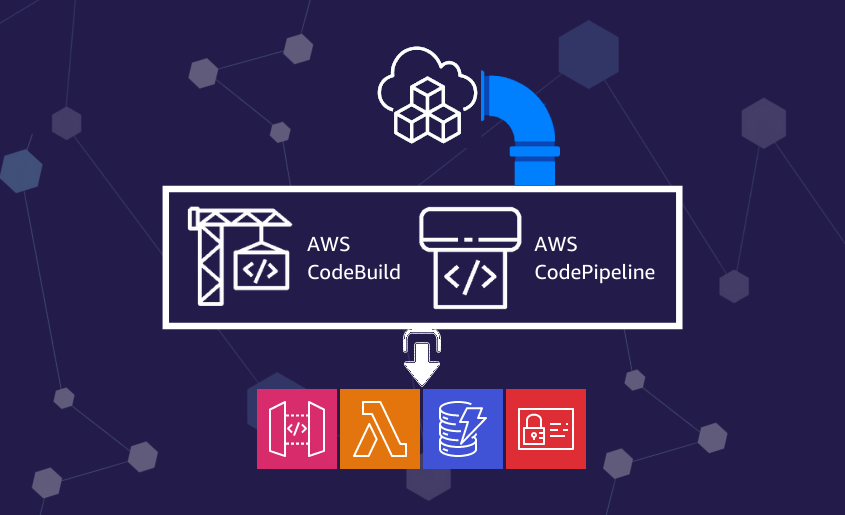

<p align="center">
  <a href="https://dev.to/vumdao">
    
  </a>
</p>
<h1 align="center">
  <div><b>CDK Typescript Pipeline Workshop</b></div>
</h1>

## Abstract
- [AWS CDK (Cloud Development Kit)](https://aws.amazon.com/cdk/) is an open-source framework which gives great depth to the concept of Infrastructure as Code
- So Why CDK Pipelines? - We need the automation way to deploy our infrastructure as code for development, staging and production stages.
- CDK pipeline with AWS Codepipeline brings to the table a feature called self mutation or self updation. This means whenever changes are pushed from a CDK project configured with CDK Pipelines, it first checks for any changes made to the pipeline itself. If there are no changes to the pipeline, it goes ahead and deploys the actual infrastructure stack.
- In this blog, I reference to cdk pipeline typescript workshop to provide the full flow and source code as a cdk pipeline project.

## Table Of Contents
 * [Pre-requisite](#Pre-requisite)
 * [Create repository and pipeline on AWS codecommit](#Create-repository-and-pipeline-on-AWS-codecommit)
 * [Add pipeline stages to deploy CDK stacks](#Add-pipeline-stages-to-deploy-CDK-stacks)
 * [Push code to test pipelines](#Push-code-to-test-pipelines)
 * [Test webapp](#Test-webapp)
 * [Cleanup](#Cleanup)
 * [Conclusion](#Conclusion)

---

## 🚀 **Pre-requisite** <a name="Pre-requisite"></a>
- Install typescript, node, and aws0 as well as projen (optional) which is a tool of managing project configuration as code.
- [Getting started with aws-cdk](https://docs.aws.amazon.com/cdk/v2/guide/getting_started.html)

## 🚀 **Create repository and pipeline on AWS codecommit** <a name="Create-repository-and-pipeline-on-AWS-codecommit"></a>
- We create infrastruture as code and build pipeline for it, so we need to create repository and then define the pipeline. So we create them manually using `cdk deploy`
- Following source code creates a repository and a pipeline function to create pipeline base on input branch.
  ```
  import { Stack, StackProps } from 'aws-cdk-lib';
  import { Repository } from 'aws-cdk-lib/aws-codecommit';
  import { CodeBuildStep, CodePipeline, CodePipelineSource } from 'aws-cdk-lib/pipelines';
  import { Construct } from 'constructs';
  import { DEV_REGION, PROD_REGION } from './constants';
  import { WorkshopPipelineStage } from './pipeline-stage';

  export class CdkPipelineTest extends Stack {
    constructor(scope: Construct, id: string, props: StackProps) {
      super(scope, id, props);

      const repo = new Repository(this, 'workshop-cdk-pipeline-repo', {
        description: 'Test CDK pipeline',
        repositoryName: 'cdk-pipeline-test',
      });

      const genPipeline = function(_scope: Construct, branch: string) {
        const _pipeline = new CodePipeline(_scope, `workshop-cdk-pipeline-${branch}`, {
          pipelineName: `workshop-cdk-pipeline-${branch}`,
          synth: new CodeBuildStep('SynthStep', {
            input: CodePipelineSource.codeCommit(repo, branch),
            installCommands: ['npm install -g aws-cdk'],
            commands: [
              'yarn install --frozen-lockfile',
              'npx projen build',
              'npx projen synth',
            ],
          }),
        });
        return _pipeline
      }
    }
  }
  ```

- Run `cdk deploy` to create reposity

  

## 🚀 **Add pipeline stages to deploy CDK stacks** <a name="Add-pipeline-stages-to-deploy-CDK-stacks"></a>
- We create pipeline for `master` and `develop` branches. `master` branch represent for product environment which is deployed on region `ap-southeast-1` and `develop` branch represents for development/test environment which is deployed on region `ap-south-1`.
- And note that, we use Dev/test environment to host the codecommit and pipeline (it's up to you to decide this).
  ```
  const developPipeline = genPipeline(this, 'HitCounterHandler` evelop');
  const masterPipeline = genPipeline(this, 'master');
  ```

- From the pipeline we add stages which is our application stacks
  ```
  developPipeline.addStage(new WorkshopPipelineStage(this, 'Deploy', {
    env: {
      account: this.account,
      region: DEV_REGION
    }
  }));

  masterPipeline.addStage(new WorkshopPipelineStage(this, 'DeploySin', {
    env: {
      account: this.account,
      region: PROD_REGION
    }
  }));
  ```

  

- The application stacks here is the CDK Workshop which includes
  - API GW (REST API) to handle api request with lambda integration.
  - The lambda function `HitCounterHandler` counts the API hits and stores them in dynamoDB and then call the `HelloHandler` lambda function to return output which is `string` text.

  

- Run `cdk deploy` again to add the pipelines.

  

## 🚀 **Push code to test pipelines** <a name="Push-code-to-test-pipelines"></a>
- We now already have repository and pipeline, next steps we add `git remote origin` as our codecommit repo and then push code to `master` / `develop` branch in order to let the pipeline deploy the CDK application stacks.
- Add remote origin
  ```
  ⚡ $ git remote add origin ssh://git-codecommit.ap-southeast-1.amazonaws.com/v1/repos/cdk-pipeline-test
  ⚡ $ git add -A
  ⚡ $ git push origin master
  ```

- Check source code repo and pipeline

  

  

- Cloudformation check stacks

  

- Create `develop` branch and then push to deploy dev/test environment
  ```
  ⚡ $ git checkout -b develop origin/master
  ⚡ $ git push origin develop
  ```

  

## 🚀 **Test webapp** <a name="Test-webapp"></a>
- Go to API GW stages and get the invoke url

  

- Use `curl` to call API request
  ```
  ⚡ $ curl https://5fbyi7ak9e.execute-api.ap-south-1.amazonaws.com/prod
  Hello, CDK! You've hit /

  ⚡ $ curl https://5fbyi7ak9e.execute-api.ap-south-1.amazonaws.com/prod/hello
  Hello, CDK! You've hit /hello
  ```

- Check DynamoDB for hit counter

  

## 🚀 **Cleanup** <a name="Cleanup"></a>
- To clean up the stacks from this workshop, navigate to the Cloudformation Console, select your stacks, and hit “Delete”. This may take some time.

## 🚀 Conclusion <a name="Conclusion"></a>
- Teams now can use CDK to create/update infrastructure through cdk-pipeline without caring about the permission to run `cdk deploy`

---

References:
- https://cdkworkshop.com/20-typescript.html

---

<h3 align="center">
  <a href="https://dev.to/vumdao">:stars: Blog</a>
  <span> · </span>
  <a href="https://github.com/vumdao/cdk-ts-pipeline-workshop/">Github</a>
  <span> · </span>
  <a href="https://stackoverflow.com/users/11430272/vumdao">stackoverflow</a>
  <span> · </span>
  <a href="https://www.linkedin.com/in/vu-dao-9280ab43/">Linkedin</a>
  <span> · </span>
  <a href="https://www.linkedin.com/groups/12488649/">Group</a>
  <span> · </span>
  <a href="https://www.facebook.com/CloudOpz-104917804863956">Page</a>
  <span> · </span>
  <a href="https://twitter.com/VuDao81124667">Twitter :stars:</a>
</h3>
